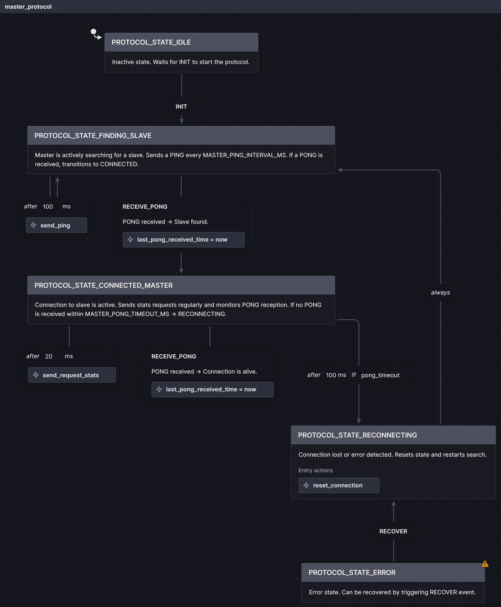
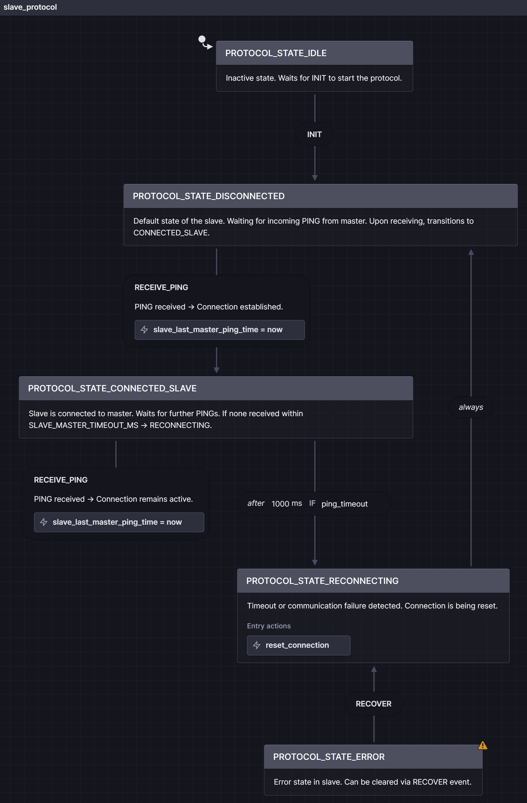

# Robust STM32 UART/DMA Communication Framework


This project provides a robust, state-driven, master-slave communication protocol for STM32 microcontrollers. It leverages DMA for CPU-efficient data transfer and implements a clean, two-layer architecture to separate hardware control from application logic.

The primary goal is to deliver a reliable, fault-tolerant communication system that automatically recovers from disturbances. This framework is designed to serve as a solid foundation for complex embedded systems where a stable data link is critical.

---

## 📑 Table of Contents

- [⚙️ Core Features & Philosophy](#️-core-features--philosophy)
- [🛠️ Background: The Hardware Layer in Practice](#️-background-the-hardware-layer-in-practice)
- [🔌 Fault Tolerance & Auto-Recovery](#-fault-tolerance--auto-recovery)
- [🚀 Getting Started: Integration Guide](#-getting-started-integration-guide)
- [🧩 Extending the Protocol](#-extending-the-protocol)
- [📚 Abbreviations](#-abbreviations)
- [🙏 Credits and Inspiration](#-credits-and-inspiration)

---

## ⚙️ Core Features & Philosophy

### Modular Architecture

The framework is divided into two distinct layers to ensure maximum portability and maintainability:

- **UART Layer (`uart.c` / `uart.h`)**  
  Handles USART + DMA, framing, and CRC32 checks. Fully hardware-focused.

- **Protocol Layer (`protocol.c` / `protocol.h`)**  
  Implements the actual logic, roles (Master/Slave), and state machine behavior. Accesses only the UART public API.


### Non-Invasive Debugging

**Info**: Instead of `printf` debugging (which would interfere with UART), the system exposes internal status variables for inspection via a debugger.

Useful globals:

- `protocol_current_state` – current FSM state
- `protocol_debug_stats` – ping/pong/error counters
- `huart_comm.stats` – hardware stats (CRC errors, overruns, timeouts)

---

## 🛠️ Background: The Hardware Layer in Practice

### UART Reception (RX) with DMA Circular Mode

The RX design enables robust reception of arbitrary-length packets using minimal CPU time.

1. **DMA in Circular Mode**  
   DMA streams incoming UART bytes directly into a circular buffer — no CPU involvement.

2. **USART IDLE Line Detection**  
   Detects end of transmission based on line inactivity → triggers an **IDLE interrupt**.

3. **DMA HT/TC Events**  
   Ensures the system catches data even when the IDLE line isn't triggered. Interrupts on half or full buffer events.

**Result:** All packets received efficiently and safely, regardless of length or timing.


### UART Transmission (TX) with DMA

1. Protocol layer calls `UART_SendPacketDMA(...)`
2. UART layer assembles complete packet (header + payload + CRC)
3. DMA sends buffer to UART TX register autonomously
4. `TC` (Transfer Complete) interrupt signals finished transmission

**CPU Load:** Near-zero during TX — ideal for real-time systems.

---

## 💥 Fault Tolerance & Auto-Recovery

A resilient state machine architecture actively manages the connection.

### State-Driven Design

- Examples: `FINDING_SLAVE`, `CONNECTED_MASTER`, `DISCONNECTED`
- Logic separated via `Protocol_MasterLogic()` / `Protocol_SlaveLogic()`

### Event-Driven Timeouts

**Warning**: Timeouts are based on **hardware events**, not just software counters.

- If Master misses `PONG` → timeout → `RECONNECTING`
- If Slave misses `PING` → timeout → disconnect
- Timeouts reset only on verified incoming packets (e.g. via IDLE interrupt)

### Hardware Error Response

- Errors like **Overrun** (`UART_ERR_OVERRUN`) are caught in the IRQ handler.
- Immediate protocol reset triggered via `PROTOCOL_OnErrorOccurred()`

Ensures fast recovery and desync prevention.


### Master State Machine

[](./assets/master_protocol_en_dark.png)


### Slave State Machine

[](./assets/slave_protocol_en_dark.png)

---

## 🚀 Getting Started: Integration Guide

### 1. Include Headers and Define Role

```c
#include "protocol.h"

// Define the role for this device
#define MY_DEVICE_ROLE PROTOCOL_ROLE_MASTER
// #define MY_DEVICE_ROLE PROTOCOL_ROLE_SLAVE
```


### 2. Initialize the UART Handle

> ⚠️ **Important:** Do **not** use `MX_USARTx_UART_Init()` from CubeMX.  
> The UART is fully initialized by this library.

```c
// Global handles in main.c
UART_Handle_t huart_comm;
CRC_HandleTypeDef hcrc;

int main(void) {
    HAL_Init();
    SystemClock_Config();
    MX_GPIO_Init();
    MX_CRC_Init(); // Required

    // Configure the UART handle
    huart_comm.instance        = USART2;
    huart_comm.dma_instance    = DMA1;
    huart_comm.rx_dma_channel  = LL_DMA_CHANNEL_6;
    huart_comm.tx_dma_channel  = LL_DMA_CHANNEL_7;

    PROTOCOL_Init(&huart_comm, MY_DEVICE_ROLE);

    while (1) {
        PROTOCOL_Process(); // must run regularly
    }
}
```


### 3. Monitor Communication Status

You can inspect the following globals in the debugger or logging system:

- `protocol_current_state` – FSM state
- `protocol_debug_stats` – app-level stats
- `huart_comm.stats` – low-level UART stats
- `latest_slave_stats` – (master only) received from slave

---

## 🧩 Extending the Protocol

Adding new commands is **easy and clean**:

### Step 1: Define Command in `protocol.h`

```c
#define PROTOCOL_CMD_REQUEST_STATS 0x10
#define PROTOCOL_CMD_SEND_STATS    0x11
```


### Step 2: Implement Handler in `protocol.c`

```c
static void Protocol_HandleRequestStats(uint8_t sender_role, uint8_t *data, uint16_t len) {
    if (my_current_role == PROTOCOL_ROLE_SLAVE && sender_role == PROTOCOL_ROLE_MASTER) {
        Protocol_SlaveStats_t my_stats;
        memcpy(&my_stats, (void*)&g_huart->stats, sizeof(Protocol_SlaveStats_t));

        UART_SendPacketDMA(g_huart, my_current_role, PROTOCOL_CMD_SEND_STATS,
                           (uint8_t*)&my_stats, sizeof(my_stats));
        protocol_debug_stats.stats_sent_count++;
    }
}
```


### Step 3: Register in `protocol_command_table`

```c
static const Protocol_Cmd_t protocol_command_table[] = {
    { PROTOCOL_CMD_REQUEST_STATS, Protocol_HandleRequestStats },
    { PROTOCOL_CMD_SEND_STATS,    Protocol_HandleSendStats },
    // Add your new commands here
};
```

No changes needed in the core FSM — fully modular design.

---

## 📚 Abbreviations

| Abbreviation | Description                                 |
|--------------|---------------------------------------------|
| **UART**     | Universal Asynchronous Receiver-Transmitter |
| **DMA**      | Direct Memory Access                        |
| **CRC**      | Cyclic Redundancy Check                     |
| **ISR**      | Interrupt Service Routine                   |
| **CPU**      | Central Processing Unit                     |
| **HAL/LL**   | ST's HAL / Low-Layer Drivers                |
| **HT/TC**    | Half-Transfer / Transfer-Complete           |

---

## 🙏 Credits and Inspiration

This project was inspired by **Tilen Majerle**’s excellent [stm32-usart-uart-dma-rx-tx](https://github.com/MaJerle/stm32-usart-uart-dma-rx-tx) repository.  
His work provided a solid foundation for DMA-based UART communication on STM32 microcontrollers.